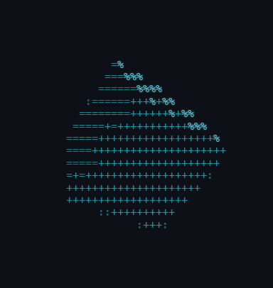

## Aditya Vaish · open source developer

**role** Software Engineer  
**community** Team Lead @ GDG · DAIICT · @ossdaiict  
**education** B.Tech ICT @ DAIICT · class of '28  
**focus** AI agents · ML · developer tooling  

`$ status > Building...`

```
╭─┤ ~/profile ├──────────────────────────────────────────────────────╮
│   ── skills ──────────────────────────────────────────────────     │
│   Python      ████████████████████████                             │
│   TypeScript  █████████████████████░░░                             │
│   JavaScript  █████████████████░░░░░░░                             │
│   Rust        ██████████░░░░░░░░░░░░░░                             │
│   C / C++     ██████████████████░░░░░░                             │
│   ── experience.log ──────────────────────────────────────────     │
│   * present  GDG Team Lead · DAIICT · workshops & OSS              │
│   * Jul'26   Core Code Reviewer @ Datacurve.ai (YC W24)            │
│   * Aug'25   Product Engineer Intern @ KwezyHQ                     │
│   * Apr'25   Product Engineer Intern @ Superr.ai                   │
│   ── trophies.log ────────────────────────────────────────────     │
│   * IIM-A CTDP '25  ·  dyslexia detection via CV                   │
│   * IIM-A IMRC '25  ·  XGBoost agri price forecasting              │
╰────────────────────────────────────────────────────────────────────╯
```

[LinkedIn](https://www.linkedin.com/in/aditya-vaish-370494243/) · [Discord](https://discord.com/users/setto_codescape_08) · [Email](mailto:adityavaish846@gmail.com) · [GitHub](https://github.com/vaishcodescape)

`$ echo "thanks for scrolling — now go build something awesome"` **▮**

<p align="center"></p>
