```
╭─┤ whoami ├─────────────────────────────────────────────────────────╮
│                                                                    │
│   Aditya Vaish  ·  open source developer                           │
│                                                                    │
│   > role        Software Engineer                                  │
│   > community   Team Lead @ GDG on Campus · DAIICT · @ossdaiict    │
│   > education   B.Tech ICT @ DAIICT  ·  class of '28               │
│   > focus       AI agents · machine learning · developer tooling   │
│                                                                    │
│   $ status  >  Building...                                         │
│                                                                    │
╰────────────────────────────────────────────────────────────────────╯
```

## `>` skills

<p>
  
</p>

---

## `>` experience

```
╭─┤ experience.log  ::  git log --oneline ├──────────────────────────╮
│                                                                    │
│   *  present   Team Lead @ GDG on Campus · DAIICT                  │
│   │            workshops · OSS contributions · community platforms │
│   │                                                                │
│   *  July'26  Core Code Reviewer & OSS Dev @ Datacurve.ai (YC W24) │
│   │            agent eval infra · sandboxing · Shipd.ai platform   │
│   │                                                                │
│   *  August'25 Product Engineer Intern @ KwezyHQ                   │
│   │            CV/OCR pipeline · AWS EC2 · CI/CD for production    │
│   │                                                                │
│   *  April'25  Product Engineer Intern @ Superr.ai                 │
│   │            LLM education features · backend services           │
│                                                                    │
╰────────────────────────────────────────────────────────────────────╯
```

## `>` open source

```
╭─┤ contribs.log  ::  shipped upstream ├─────────────────────────────╮
│                                                                    │
│   *  SurfSense (13.9k★)                                            │
│   │  fixed backend security vuln in chat-routes  ·  PR #370        │
│   │                                                                │
│   *  Superset (YC)                                                 │
│   │  Slack integration reliability · safe JSON / 400s  ·  PR #4145 │
│                                                                    │
╰────────────────────────────────────────────────────────────────────╯
```

## `>` featured builds

```
╭─┤ ~/builds  ::  ls -la ├───────────────────────────────────────────╮
│                                                                    │
│   data-spear/                                                      │
│   │  agentic DB assistant · RAG · pgvector · PostgreSQL            │
│   │  → github.com/vaishcodescape/data-spear                        │
│   │                                                                │
│   shipd-agent/                                                     │
│   │  autonomous review agent · LangGraph · Playwright · Anthropic  │
│   │  → github.com/vaishcodescape/shipd-agent                       │
│                                                                    │
╰────────────────────────────────────────────────────────────────────╯
```

[data-spear](https://github.com/vaishcodescape/data-spear) · [shipd-agent](https://github.com/vaishcodescape/shipd-agent)

## `>` achievements

```
╭─┤ trophies.log ├───────────────────────────────────────────────────╮
│                                                                    │
│   *  IIM Ahmedabad CTDP 2025  ·  AI Accessibility                  │
│   │  dyslexia detection via fine-tuned CV · top accessibility      │
│   │                                                                │
│   *  IIM Ahmedabad IMRC 2025  ·  ML Forecasting                    │
│   │  XGBoost agri price prediction on government datasets          │
│                                                                    │
╰────────────────────────────────────────────────────────────────────╯
```

## `>` stats

## `>` connect

[LinkedIn](https://www.linkedin.com/in/aditya-vaish-370494243/)  [Discord](https://discord.com/users/setto_codescape_08)  [Email](mailto:adityavaish846@gmail.com)  [GitHub](https://github.com/vaishcodescape)

`$ echo "thanks for scrolling — now go build something awesome"` **▮**